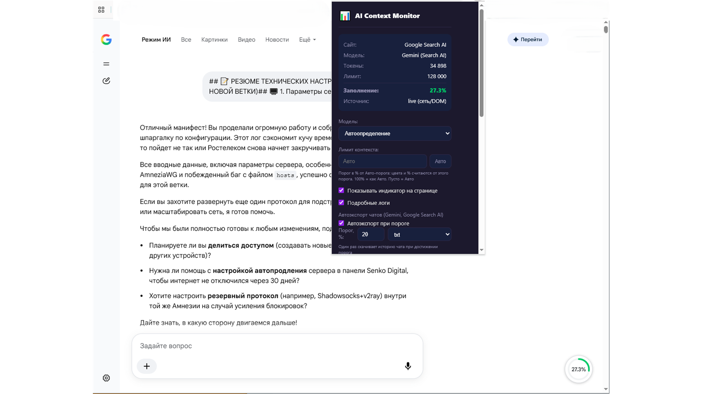
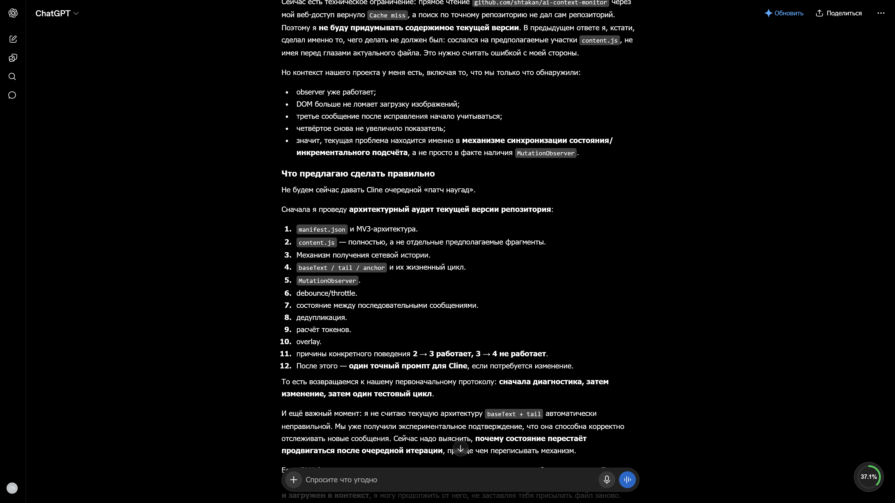
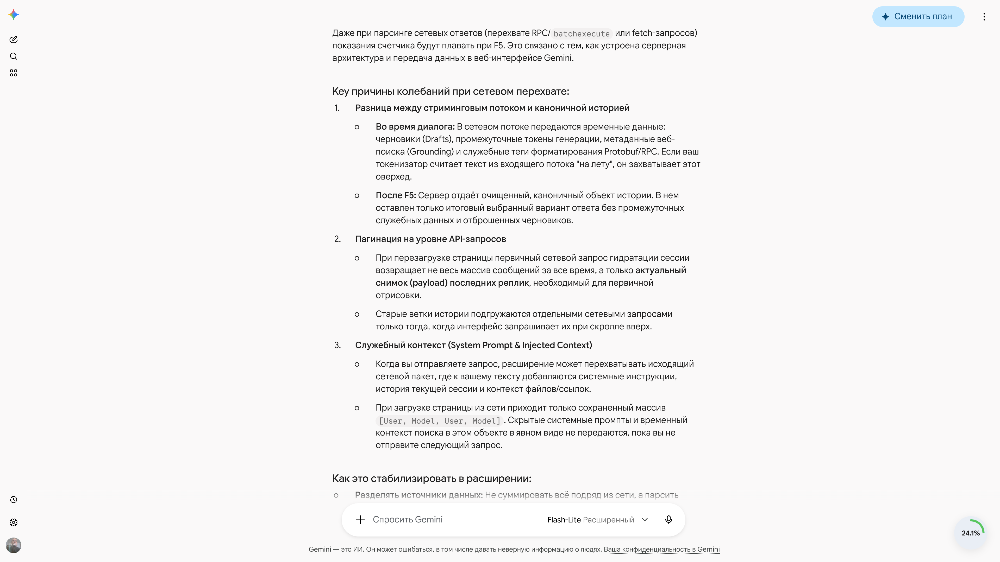

# AI Context Monitor

Расширение работает **без API-ключа** «из коробки» — ключ нужен только для повышения точности подсчёта токенов на Google Gemini.

Расширение для Google Chrome, которое показывает в процентах, насколько заполнено контекстное окно вашего диалога с ИИ на поддерживаемых сайтах. Когда переписка становится слишком длинной, модель начинает терять детали — индикатор помогает вовремя это заметить, меняя цвет с зелёного на жёлтый, а затем на красный.

Виджет в правом нижнем углу экрана в реальном времени обновляет процент использованного контекста. При наведении показывает подробности: название модели, количество токенов и предел.

## Поддерживаемые платформы

- **Google Gemini** (gemini.google.com) — чат с ИИ
- **Google AI Search** (google.com/search, режим ИИ) — поиск с ИИ-ответами
- **ChatGPT** (chatgpt.com)
- **DeepSeek** (chat.deepseek.com)
- **Claude** (claude.ai) — чат с ИИ
- **Perplexity** (perplexity.ai) — поиск и чат с ИИ

## Как это работает

- Индикатор в углу экрана показывает процент использованного контекста от лимита «Авто» (128 000 токенов). При превышении 80% кольцо становится красным.
- История диалога подтягивается автоматически из сети, без прокрутки чата.
- Модель определяется автоматически по данным сайта.
- Изображения включаются в расчёт как приблизительная оценка токенов.
- Без API-ключа используется приблизительная локальная оценка токенов.
- С API-ключом — точный подсчёт через официальный Gemini API (countTokens).
- Настраиваемый **«Порог»** — пользовательский процент от авто-порога, при котором индикатор считается заполненным на 100%.

## Порог

Контекстное окно модели и реальная потеря контекста — не одно и то же. Модель начинает «забывать» ранние сообщения **раньше** формального лимита: на практике в ChatGPT при заполнении окна примерно на 20–25% модель уже может задать вопрос, ответ на который был в самом начале переписки.

**«Порог»** — пользовательская настройка виджета, которая позволяет заранее увидеть, что диалог пора переносить в новый чат. Это процент от **авто-порога** — оценённой точки, где модель начинает терять детали. Расширение считает этот процент за 100% заполнения и пересчитывает от него процентную шкалу и цветовые зоны (зелёный/жёлтый/красный).

- **100% = Авто** — поведение по умолчанию, стандартный порог потери деталей (128 000 токенов для большинства моделей).
- **Меньше 100% = строже** — цветовые зоны и процент отображаются от пользовательского порога, а не от лимита модели. Например, при пороге 10% жёлтая зона наступает, когда авто-порог заполнен на ≈5%, красная — на ≈8%.
- **«Текущее = 100%»** — фиксирует текущее заполнение как 100%. Удобно, чтобы отметить момент, когда вы лично убедились, что модель уже теряет контекст.
- **«Авто»** — возвращает стандартный порог, пересчитывая шкалу обратно.

Настройка хранится локально в браузере и применяется ко всем поддерживаемым платформам.

## Скриншоты

**Google AI Search — зелёная зона (35%) и окно расширения:**

**ChatGPT — красная зона (больше 80%):**

**Gemini — жёлтая зона (больше 50%):**

## Точный подсчёт через API-ключ (необязательно)

API-ключ нужен, чтобы вместо приблизительной оценки расширение показывало точное число токенов — такое же, какое видит сама модель. Ключ хранится **только в браузере пользователя** (в `chrome.storage.local`) и никуда не отправляется, кроме официального Google AI Studio endpoint для запроса `countTokens`.

### Как получить ключ Google AI Studio (пошагово)

1. Откройте [https://aistudio.google.com](https://aistudio.google.com) и войдите в Google-аккаунт.
2. Перейдите в раздел «Get API key» (в левом меню или в шапке сайта).
3. Нажмите «Create API key» (выберите проект по умолчанию, если спросит).
4. Скопируйте появившийся ключ.

### Как вставить ключ в расширение

1. Кликните по значку расширения на панели браузера.
2. В поле «Gemini API key» вставьте скопированный ключ.
3. Включите переключатель «Точный подсчёт токенов через Gemini API».

*Примечание:* у Google AI Studio есть щедрый бесплатный лимит — его с большим запасом хватает для личного пользования индикатором.

**Предупреждение:** никогда не передавайте ключ третьим лицам и не публикуйте его в открытом доступе.

## Установка

### Из Chrome Web Store

Скоро будет доступно.

### Вручную

1. Скачайте расширение: нажмите **Code → Download ZIP** на странице репозитория.
2. Распакуйте архив в любую папку на компьютере.
3. Откройте в браузере `chrome://extensions`.
4. Включите **«Режим разработчика»** (переключатель справа сверху).
5. Нажмите **«Загрузить распакованное расширение»**.
6. Выберите папку с распакованным расширением.
7. Готово — в углу экрана появится индикатор заполнения контекстного окна.

## Примечания и ограничения

- В ChatGPT и Google Gemini прикреплённые изображения учитываются в процентах оценочно (по фиксированной оценке токенов за каждое изображение), поэтому «картиночные» диалоги тоже показывают честное заполнение.
- В AI-режиме Google Search модель берётся из сетевого ответа (например, gemini-1.5-flash) и может отличаться от модели на других вкладках.
- Небольшие расхождения с внутренними счётчиками платформ — это нормально: каждая платформа считает токены по-своему, а расширение даёт единую оценку для всех.