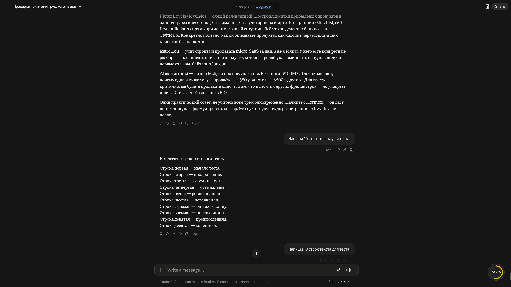
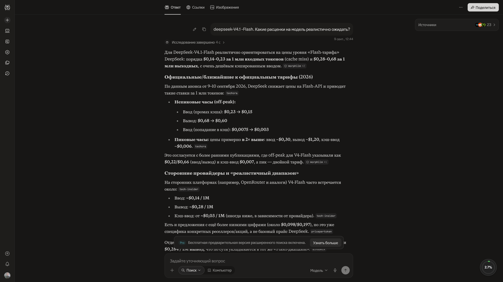

# AI Context Monitor

A Chrome and Microsoft Edge (Chromium) extension (Manifest V3) that shows in real time how full the AI context window of your conversation is, across six platforms. When a chat grows too long, models start losing details — AI Context Monitor warns you before that happens and can save the whole conversation automatically.

## Ручная установка

Расширение распространяется без магазина (публикация в Edge Add-ons отложена). Основной канал — GitHub Releases.

1. Скачайте архив `ai-context-monitor-v2.0.3.zip` со страницы релиза: <https://github.com/shtakan/ai-context-monitor/releases/tag/v2.0.3>
2. Распакуйте архив в любую папку.
3. **Microsoft Edge**: откройте `edge://extensions`, включите **«Режим разработчика»**, нажмите **«Загрузить распакованное расширение»** и выберите папку распаковки.
4. **Google Chrome**: откройте `chrome://extensions` и выполните те же действия.

> **Обновление**: скачайте новый ZIP и повторите шаги 2–4, либо нажмите «Обновить» (Reload) на плитке расширения на странице управления расширениями.

Расширение полностью открыто ([исходный код](../../tree/main)): магазин не обязателен, вы всегда можете собрать и установить его вручную из репозитория.

## Features

## Features

- **6 supported platforms**: Google Gemini, ChatGPT, DeepSeek, Claude, Perplexity, Google AI Search.
- **Real-time fill badge**: a live widget in the corner of the screen showing context fill (%, tokens / limit, model name), updated as you chat.
- **Auto-export at threshold**: when the configured fill threshold is reached, the full chat history is downloaded automatically as `txt`/`md` — once per chat, only after the complete history has been loaded.
- **DeepSeek reasoning in exports**: DeepSeek returns chain-of-thought fragments (`THINK`) alongside the answer, so an exported DeepSeek turn keeps both — `[REASONING] … [ANSWER] …`. Turns without reasoning (and every other platform) keep the previous export format unchanged.
- **Invisible full-history loader**: fetches the entire conversation in the background — no manual scrolling needed.
- **100% client-side**: no accounts, no servers, no telemetry. Everything runs locally in your browser.
- **Optional exact token counting** via the official Gemini `countTokens` API with your own key (BYOK).

## Install

1. Download the ZIP from the [Releases](../../releases) page.
2. Unpack it into any folder.
3. Open `chrome://extensions` in Chrome.
4. Enable **Developer mode** (toggle in the top-right corner).
5. Click **Load unpacked** and select the unpacked folder.

## Microsoft Edge (Chromium)

The extension targets Manifest V3 and uses only the cross-browser `chrome.*` APIs, so it runs unchanged in Microsoft Edge, which is built on the same Chromium engine. The offline guide (`docs/index.html`) and the screenshots are shipped inside the package, so the **Помощь / Help** link in the settings footer works after installation.

Install as an unpacked extension:

1. Download the ZIP from the [Releases](../../releases) page and unpack it into any folder.
2. Open `edge://extensions` in Microsoft Edge.
3. Enable **Developer mode** (toggle in the left-hand sidebar).
4. Click **Load unpacked** and select the unpacked folder.

Publication in the [Microsoft Edge Add-ons](https://microsoftedge.microsoft.com/addons) store is planned; until then the unpacked install above is the supported Edge path.

## Quick start

1. Click the extension icon to open the popup.
2. Set the **auto-export threshold** (50–99% of the context window) and the export format (`txt` or `md`).
3. Toggle **Detailed logs** if you need verbose console output for troubleshooting.
4. *(Optional)* Paste your **Gemini API key** (BYOK) to switch from local estimation to exact token counting via `countTokens`.

## Architecture

Hybrid capture pipeline:

```
MAIN world interceptors (fetch/XHR)
        |  CustomEvents
        v
ISOLATED content script  -->  badge / auto-export / invisible loader
        |
        v
service worker (core/background.js)
```

- Platform adapters (`adapters/*`) intercept network responses in the MAIN world and forward full network snapshots via CustomEvents to the ISOLATED content script (`core/content.js`), which maintains state, renders the badge, triggers auto-export and runs the invisible history loader; the service worker handles background tasks.
- Export text assembly lives in `utils/export-text-builders.js`; reference/context text building in `utils/buildReferenceText.js`.

## Tests

```bash
npm test
```

Runs Jest — **as of v2.0.3 (2026-09-15): 82 suites / 1394 tests**, green in CI. The counters are a dated snapshot of the v2.0.3 tree and are deliberately not re-pinned on every change; the live numbers are whatever `npm test` prints as its `Tests: ... total` line. Sanitized fixtures are bundled in `tests/fixtures`. Personal ("live") captured samples are gitignored — tests that require them are skipped automatically when those files are absent.

## Privacy

Everything stays local: no telemetry, no analytics, no data collection. The only outbound requests go to the chat sites themselves and, optionally, to the Gemini API with your own key. Your BYOK key is stored only in `chrome.storage` on your machine.

The full policy ships with the extension and opens offline from the settings footer: [privacy/privacy.html](privacy/privacy.html).

## Screenshots

Five live captures, one per platform, stored in [`docs/screenshots/`](docs/screenshots/). The same files are bundled into the release ZIP and rendered by the offline guide in `docs/index.html`.

**Gemini — yellow zone (over 50%)**


**ChatGPT — red zone (over 80%)**


**Google Search AI popup — badge and extension popup**


**Claude — context indicator (Sonnet / Opus / Haiku, 200K window)**



**Perplexity — thread and answer-stream interception (Sonar / Sonar Pro)**



## Known limitations

- **Third-party interceptors on the same page.** If another extension on the same tab also monkey-patches `fetch` / `XMLHttpRequest` (for example, DeepSeek++ or All API Hub on chat.deepseek.com), the two interception layers compete for the same network stream. Symptoms vary — missing turns, garbled fragments, role mismatches — and depend on load order, which this extension cannot control. **Workaround**: keep ai-context-monitor as the only network-intercepting extension on the tab you are monitoring, or disable the other interceptors while exporting.
- **Google Search AI (GSA) server-side history trimming.** GSA can silently trim the server-side thread (observed: 59 → 6 messages). The extension counts exactly what the server returns; it cannot recover messages the server has already dropped.

## Disclaimer

This project is not affiliated with, endorsed by, or sponsored by Google, OpenAI, Anthropic, DeepSeek, Perplexity, or any other company mentioned. All product names and trademarks are the property of their respective owners.

## License

[MIT](LICENSE)
